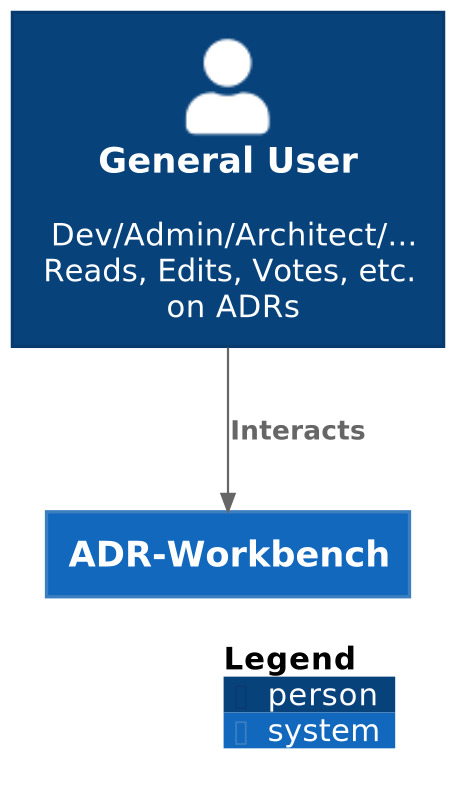
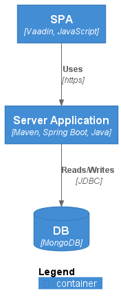
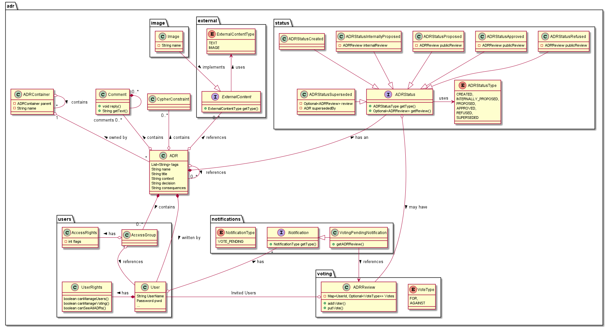
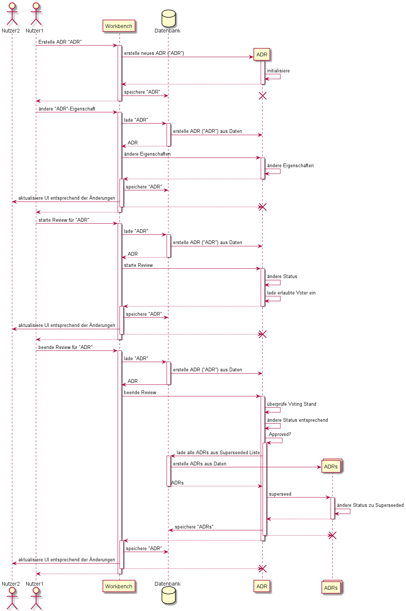

[options="header"]
[cols="1, 3, 3"]
|===
|Version | Bearbeitungsdatum   | Autor
|0.1	 | 13.11.2021          | Gruppe swt21w45
|===

= Entwicklerdokumentation

== Einführung und Ziele
=== Aufgabenstellung
Im Softwarepraktikum soll eine Workbench entworfen und prototypisch implementiert werden, mit
welcher die Einstiegshürde zur Arbeit mit ADRs und jQAssistant verringert und somit die Einführung
dieser Tools in Softwareprojekten vereinfacht wird.

Hauptaugenmerk ist dabei die kollaborative Arbeit
an Architekturentscheidungen und deren schrittweise Identifikation im Code mittels jQAssistant. Die
Nutzer sollen durch die Anwendung durch den Prozess der Erstellung und Weiterentwicklung der
Dokumente geleitet und so bestmöglich in Ihrer Arbeit unterstützt werden. Dies gilt insbesondere beim
umfangreichen Einsatz von ADRs.

*Grundlegende Anforderungen* liegen bei der:

* kollaborativen Erarbeitung und Dokumentation von Architekturentscheidungen mit ADRs

* iterativen Identifikation von Architekturkonzepten (Mustersprache) im Source Code mit jQAssistant

* nutzerfreundlichen Zusammenführung und Verwaltung von Dokumentation und Absicherung

* skalierbaren Verwendbarkeit bei einer großen Anzahl an Entscheidungen

Nach einer Einführung in die Arbeitsweise mit ADRs und jQAssistant und der Besprechung der in der
Praxis entstehenden Komplexität soll ein Konzept für die Workbench entworfen und mit dem
Auftraggeber schrittweise verfeinert werden, welches anschließend zu implementieren ist.

=== Qualitätsziele
[cols="1,2,1"]
|===
|Kriterium |Beschreibung |Priorität

|Lesbarkeit |Verständlichkeit des Codes | 1
|Änderbarkeit |leichte Erweiterbarkeit + Modifizierbarkeit des Codes | 2
|Testbarkeit |sichere Gewährleistung der Funktionen durch Testfälle | 3
|Bedienbarkeit |nutzerfreundliche Bedienung der Anwendung | 1
|Erlernbarkeit |intuitives Design des Frontends | 2
|===

1 = höchste Priorität; 3 = niedrigste Priorität

== Randbedingungen
=== Hardware-Vorgaben
* Verbindung zwischen  Server und Client

=== Software-Vorgaben
* aktueller Browser auf Client-Seite
** Chromium basierte Browser (z.B. Chrome, Brave, Edge), Firefox basierte Browser
** JavaScript Unterstützung nötig und aktiviert

=== Vorgaben zum Betrieb der Software
* Java-Virtual-Machine (mind. Java 17) auf Server-Seite
* kompatible Versionen von Java (Version: 17), node.js (Version: 16 oder 17) und npm (Version: 8) auf der Server-Seite

== Kontextabgrenzung

== Lösungsstrategie
=== Erfüllung der Qualitätsziele
[options="header"]
[cols="1,2"]
|===
|Qualitätsziel |Lösungsansatz

|Lesbarkeit |Einheitliche Konventionen zur Strukturierung des Codes (https://github.com/st-tu-dresden-praktikum/swt21w45/blob/main/src/main/asciidoc/Konventionen.adoc[Konventionen])
|Änderbarkeit |Implementierung verschiedener Komponenten, die erweitert werden müssen, als Interfaces. (z.B. ADR-Stati) +
Änderung von Bedingugnen für verschiedene Aktionen zentral implementiert +
  -> z.B. Test auf Lesbarkeit eines ADRs über einen ADR-Funktionsaufruf... Änderung gilt für gesammte Anwendung.
Konstatnten (z.B. Texte, Routen, Menü-Verlinkungen) gesammelt in mehereren Dateien auffind- und änderbar +
Implementation neuer Rechte (bis zu bestimmten Punkt) ohne Änderung der Datenbankstruktur möglich
|Testbarkeit |Testfälle (vorrangig für Backend) decken die wichtigsten Funktionen ab
|Bedienbarkeit |grafisch übersichtliche Benutzeroberfläche mit sinnvollen Verlinkungen und Sortierierungsmöglichkeiten +
  -> z.B. ADR-Board mit neuesten ADRs für schnellen Überblick UND ADR-Explorer für gesammtheitlichen Überblick +
  -> gesammelte Funktionalitäten (Nutzergruppen- und Nutzerverwaltung an zentralen Ort)
|Erlernbarkeit |Gruppierung gleicher Farben zu gleichen Funktionen +
wichtige Interaktionspunkte direkt bei zugehörigen Überschriften zu finden +
farbliche Sortierung der ADR-Stati zur schnellen Erkennung verschiedener Zustände
|===

== Konventionen
include::Konventionen.adoc[]

=== Softwarearchitektur

=== Entwurfsentscheidungen

==== Verwendete Muster
* Aggregation
* Komposition

==== Persistenz
* MongoDB

==== Benutzeroberfläche
* Single-Page-Application (SPA)

==== Verwendung externer Frameworks

* Spring Boot
* Vaadin
* Selenium
* Lombok

== Aufteilung der Arbeit
* *Frontend:*
** Yujia
** Leonard
** Eric
* *Backend:*
** Mahmoud
** Frode

== Bausteinsicht

[options="header"]
|===
|Klasse/Enumeration |Beschreibung
|adr.ADRContainer | Dient als ein Ordner in der Speicherhierarchie und Filterstruktur der ADRs. Enthält Default-AccessFlags für alle drin referenzierten ADRs und ADRContainers
|adr.ADR | Basisklasse zur Speicherung von relevanten Informationen von einem ADR, dazu gehören die Sektionen eines ADRs (z.B. title, content, etc.), die globalen und gruppenbezogenen AccessFlags, extern gebundene Inhalte und Dateien, User-Kommentare und Cypher-Constraints. Ein ADR kann auch abhängige ADRs referenzieren jedoch nicht besitzen, und somit eine baum-strukturierte Abhängigkeit modellieren, ohne die Speicherungshierachie zu verletzen. Ein ADR enthält auch "Tags" die als Filter-Suchwörter verwendet werden können.
|adr.Comment| Basisklasse zur Speicherung von einem User-Kommentar. Ein Kommentar kann andere Kommentare besitzen und somit die "Replies"-Hierarchie repräsentieren.
|adr.status.ADRStatus| Interface für alle Klassen die zur Speicherung von Status-relevanten Informationen (z.B. Creation date, Refusal reason, etc.) dienen.
|adr.status.ADRStatusType| Enum zur Unterscheidung zwischen den verschiedenen Status-Typen, die ein ADR annehmen kann.
|adr.status.ADRStatusCreated| Klasse zur Speicherung relevanter Informationen bezüglich eines ADRs was frisch kreiert wurde.
|adr.status.ADRStatusInternallyProposed| Klasse zur Speicherung relevanter Informationen bezüglich eines ADRs über den ein internes Voting abläuft.
|adr.status.ADRStatusProposed| Klasse zur Speicherung relevanter Informationen bezüglich eines ADRs über den ein öffentliches Voting abläuft.
|adr.status.ADRStatusApproved| Klasse zur Speicherung relevanter Informationen bezüglich eines ADRs was durch ein öffentliches Voting akzeptiert wurde.
|adr.status.ADRStatusDeclined| Klasse zur Speicherung relevanter Informationen bezüglich eines ADRs was durch ein öffentliches Voting abgelehnt wurde.
|adr.status.ADRStatusSuperseded| Klasse zur Speicherung relevanter Informationen bezüglich eines ADRs was durch einen anderen ADR abgelöst wurde.
|adr.external.ExternalContent| Basisklasse zur Speicherung von externen Inhalten. Der Typ des externen Inhalts kann über die Enum ExternalContentType angefragt werden.
|adr.external.ExternalContentType | Enum zur Unterscheidung zwischen den verschiedenen Typen, die eine externe Datei annehmen kann.
|adr.voting.VoteType| Enum zur Unterscheidung zwischen den Vote-Varianten
|adr.voting.ADRReview| Basisklasse zur Speicherung von Informationen von einem laufenden "Voting Session"
|adr.users.User| Dient der Speicherung von user-relevanten Informationen (z.B. UserName, pwd, Rechten, etc.).
|adr.users.AccessGroup| Speichert die Privilegien von einer Gruppe von users.
|adr.users.AccessRights| Speichert die AccessFlags zu einem ADR bezüglich einer Nutzergruppe.
|adr.users.UserRights| Speichert die Rechte von einem Nutzer bezüglich Nutzerverwaltung
|adr.image.Image| Speichert Metadaten von einem externen Bild
|adr.notifications.Notification| Interface für alle Notification-Typen
|adr.notifications.NotificationType| Enum zur Unterscheidung zwischen Notifications-Typen
|adr.notifications.VotePendingNotification| Speichert eine laufende Notification und referenziert den relevanten ADRReview
|===

== Laufzeitsicht

Wichtigste Interaktionen auf ADRs aufgeführt (Lebenszyklus). 

== Technische Schulden
* Notifications intern implementiert, werden bloß nicht versendet (von Komponenten)
* jQAssistant-Constraints fehlend (aufgrund großen Funktionsumfangs im bereits bestehenden Projekt... mehr als erwartet)
* eigene Zielsetzungen zur einheitlichen Codeformatierung nicht vollständig eingehalten (siehe Lesbarkeit)
* Testabdeckung (vor allem mit Selenium) gering (komplexe(s) Funktionalitäten und Zusammenspiel verschiedener Komponenten schwer flächendeckend per Tests abzudecken)
