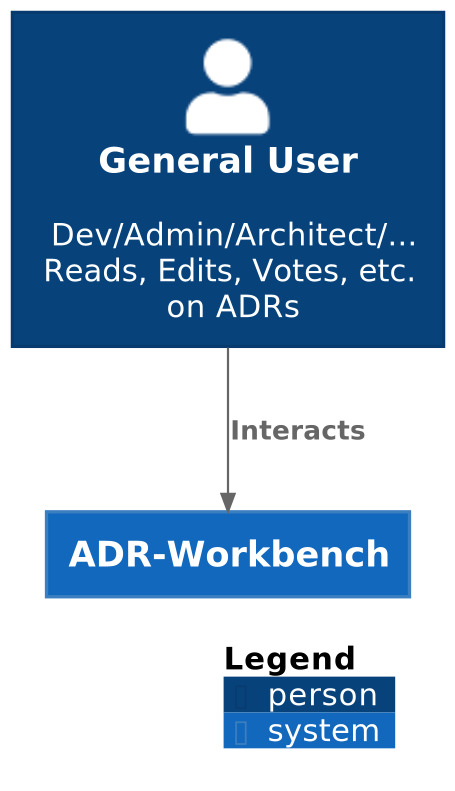
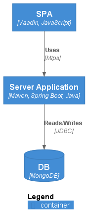
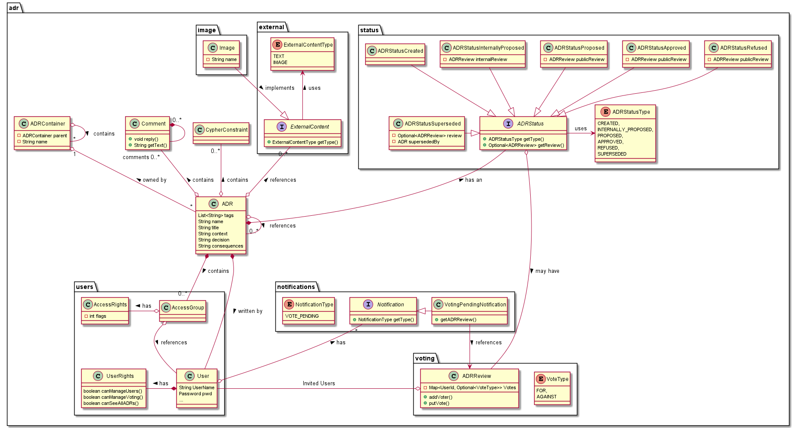
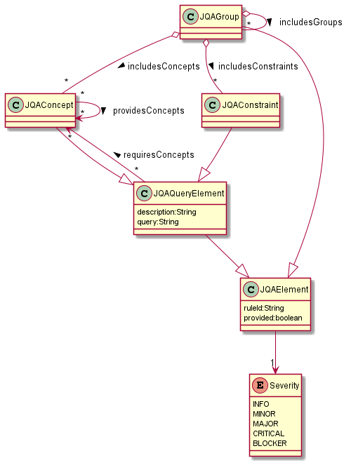

= Pflichtenheft
:project_name: ADR-Workbench
== __{project_name}__

[options="header"]
[cols="1, 1, 1, 1, 4"]
|===
|Version | Status      | Bearbeitungsdatum   | Autoren(en)           |  Vermerk
|0.1     | In Arbeit   | 10.10.2021          | Gruppe swt21w45       | Initiale Version
|0.1.5   | In Arbeit   | 23.10.2021          | Gruppe swt21w45       | Erstes Konzept
|0.2     | In Arbeit   | 29.10.2021          | Gruppe swt21w45       | Einarbeitung konkreter Konzepte
|0.2.5   | In Arbeit   | 03.11.2021          | Gruppe swt21w45       | Einarbeitung des Feedbacks vom Meeting am 01.11.21
|0.3     | Offen für Feedback | 03.11.2021   | Gruppe swt21w45       | vorerste Fertigstellung des Pflichtenheftes
|0.5     | Fast fertig        | 10.11.2021   | Gruppe swt21w45       | Bearbeitung auf Grundlage letzter Feedbackpunkte
|1.0     | Fertig             | 10.11.2021   | Gruppe swt21w45       | --
|===

== Inhaltsverzeichnis
* <<zusammenfassung>>
* <<aufgabenstellung-und-zielsetzung>>
* <<produktnutzung>>
* <<interessensgruppen-stakeholders>>
* <<systemgrenze-und-top-level-architektur>>
* <<anwendungsfälle>>
* <<funktionale-anforderungen>>
* <<nicht-funktionale-anforderungen>>
* <<gui-prototyp>>
* <<datenmodell>>
* <<akzeptanztestfälle>>
* <<glossar>>

== Zusammenfassung
Dieses Dokument beschreibt das Projekt __{project_name}__ hinsichtlich der Mindestanforderung der vereinbarten Funktionalität, sowie deren softwaretechnische Umsetzung.

== Aufgabenstellung und Zielsetzung

Im Softwarepraktikum soll eine Workbench entworfen und prototypisch implementiert werden, mit
welcher die Einstiegshürde zur Arbeit mit ADRs und jQAssistant verringert und somit die Einführung
dieser Tools in Softwareprojekten vereinfacht wird.

Hauptaugenmerk ist dabei die kollaborative Arbeit
an Architekturentscheidungen und deren schrittweise Identifikation im Code mittels jQAssistant. Die
Nutzer sollen durch die Anwendung durch den Prozess der Erstellung und Weiterentwicklung der
Dokumente geleitet und so bestmöglich in Ihrer Arbeit unterstützt werden. Dies gilt insbesondere beim
umfangreichen Einsatz von ADRs.

*Grundlegende Anforderungen* liegen bei der:

* kollaborativen Erarbeitung und Dokumentation von Architekturentscheidungen mit ADRs

* iterativen Identifikation von Architekturkonzepten (Mustersprache) im Source Code mit jQAssistant

* nutzerfreundlichen Zusammenführung und Verwaltung von Dokumentation und Absicherung

* skalierbaren Verwendbarkeit bei einer großen Anzahl an Entscheidungen

Nach einer Einführung in die Arbeitsweise mit ADRs und jQAssistant und der Besprechung der in der
Praxis entstehenden Komplexität soll ein Konzept für die Workbench entworfen und mit dem
Auftraggeber schrittweise verfeinert werden, welches anschließend zu implementieren ist.

== Produktnutzung
Die entwickelte Software soll Softwarearchitekten und Managern das kollaborative Erstellen von *Architecture Decision Records* (ADR) erleichtern / ermöglichen.

== Interessensgruppen (Stakeholders)
* juristische Partei: https://tu-dresden.de/ing/informatik/smt/st[TU Dresden], https://www.buschmais.de/[Buschmais]

* entwickelnde Partei: Gruppe *swt21w45*

== Systemgrenze und Top-Level-Architektur

=== Kontextdiagramm

=== Top-Level-Architektur

== Anwendungsfälle

=== Akteure
[cols="1,2"]
|===
|Akteur | Beschreibung
|Admin | Benutzerverwaltung (Erstellen, Ändern, Löschen); Rechteverwaltung (Rechte entziehen, Rechte vergeben); finale Entscheidungsgewalt hinsichtlich Voting; besitzt alle Funktionen des Developers
|Developer | ADRs vorschlagen, erstellen, ansehen, bearbeiten, taggen, voten / wählen, kommentieren; Benachrichtigungen über Änderungen erhalten; als Nutzer einloggen 
|===

=== Überblick Anwendungsfalldiagramm

=== Anwendungsfallbeschreibungen
In diesem Abschnitt sind ausgewählte Beispielanwendungen aufgeführt (keine vollständige Liste aller Anwendungen).
Die Kontrolle der Anwendungsfälle erfolgt über die unter "<<akzeptanztestfälle>>" aufgeührten Tests.

[cols="1,2"]
|===
|Anwendungsfall |Beschreibung
|Management von Accounts |berechtigter Nutzer erstellt neuen Nutzer (*nN1*); *nN1* wird benachrichtigt; *nN1* loggt sich im System ein; *nN1* erhält Berechtigung zum Managment von Accounts; *nN1* erstellt weiteren neuen Nutzer (*nN2*); *nN2* wird von berechtigter Person gelöscht; *nN1* löscht seinen Account
|Management von ADRs |Nutzer (*N*) erstellt ein ADR inkl. Titel; ADR Status wird auf "privat" gesetzt; erstelltes ADR wird von ADR-Übersicht aus geöffnet; *N* sieht erstelltes ADR mit allen Eigenschaften; *N* bearbeitet Eigenschaft des ADRs; *N* taggt ADR; *N* löscht ADR
|Gemeinsame Arbeit an ADR |Berechtigter Nutzer (*bN*) lädt Nutzer (*eNs*) zur Bearbeitung eines bestehenden ADRs (mit Status "privat") ein (mit Optionen auf verschiedene Mitarbeitsmodi... siehe <<kollaboratives-arbeiten>>); eingeladene Nutzer (*eNs*) werden benachrichtigt; *eNs* nehmen Einladung an/lehnen ab; *eNs* führen diverse Aktionen (entsprechend der Mitarbeitsmodi) auf dem ADR aus; *bN* schlägt ADR zum gemeinsamen internen Review vor; ADR Status wird auf "privat_proposed" gesetzt; *eNs* stimmen ab und hinterlassen Feedback; *bN* schaltet ADR für alle Nutzer frei; ADR Status wird auf "open" gesetzt; alle Nutzer können ADR einsehen; *bNs* schlägt ADR zur Fertigstellung vor; ADR Status wird auf "proposed" gesetzt; *bNs* stimmen ab; ADR wird angenommen/abgelehnt
|===

== Funktionale Anforderungen

=== Muss-Kriterien

==== Bearbeitung von ADRs:

* möglichst einfache Bearbeitung von ADRs auf grafischer Oberfläche

==== Organisation vorhandener ADRs:

* übersichtliche Ansicht für vorhandene ADRs
** verschiedene Sortierungen und Filter für einfachere Verwaltung (z.B. Filterung nach Status)
* Tags für ADRs zur einfacheren Identifikation

==== Nutzerverwaltung:

* verschiedene Berechtigungen für Benutzer (auch ADR spezifisch)
** durch berechtigte Personen erteilbare Berechtigungen für:
*** Mitarbeit an ADRs (mehrere Einzelberechtigungen; siehe <<kollaboratives-arbeiten>>)
*** Vorschlag von und Abstimmung über ADRs
*** Verwaltung von Nutzern (Erstellung + Löschung + erteilen von Berechtigungen)

==== kollaboratives Arbeiten:

* Einladen von Usern zu Mitarbeit an ADRs zum
** Einsehen der ADR-Inhalte
** kommentieren der ADRs
*** Kommentare zu bestimmten Zeilen im ADR erstellen
*** Kommentare beantworten
** mitbearbeiten der ADRs
*** Benachrichtigung von Nutzern bei eingehenden Änderungen während der Bearbeitung eines ADRs
** teilnehmen an geschlossenen Reviews (+ evtl. Voting)

==== Constraint-Anhänge für ADRs:

* anhängen von Constraints (jQAssistant) an ADRs
* Integration von jQAssistant-Regeln

{empty} +

=== Kann Kriterien

==== Bearbeitung von ADRs:

* Referenzierung hochgeladener Inhalte (z.B. Einbindung AsciiDoc Dateien)

==== Organisation vorhandener ADRs:

* Historie von durchgeführten Änderungen
** mögliche Wiederherstellung älterer Versionen
* Export vorhandener ADRs (Asciidoc)

==== Nutzerverwaltung:

* Einteilung in Nutzergruppen mit geteilten Berechtigungen

==== kollaboratives Arbeiten zwischen Nutzern:

* synchrone Bearbeitung von ADRs mit mehreren Entwicklern
* Benachrichtigung über diverse Vorgänge per Mail
* Dashboard für Nutzer mit neuesten Aktivitäten (z.B. Änderungen in relevanten ADRs) evtl Kanban-Board

==== Constraint-Anhänge für ADRs:

* Ausführung von jQAssistant-Constraints gegen eine Neo4J-Datenbank

==== Grafische Oberfläche:

* verschiedene Spracheinstellungen
* Theming nach Buschmais Farben
* Karl Klammer (Clippy) ähnliches Hilfe-Tool zur Einfindung in die Anwendung

{empty} +

== Nicht-Funktionale Anforderungen

=== Qualitätsziele

[cols="1,2,1"]
|===
|Kriterium |Beschreibung |Priorität

|Lesbarkeit |Verständlichkeit des Codes | 1
|Änderbarkeit |leichte Erweiterbarkeit + Modifizierbarkeit des Codes | 2
|Testbarkeit |sichere Gewährleistung der Funktionen durch Testfälle | 3
|Bedienbarkeit |nutzerfreundliche Bedienung der Anwendung | 1
|Erlernbarkeit |intuitives Design des Frontends | 2
|===

1 = höchste Priorität; 3 = niedrigste Priorität

=== Konkrete Nicht-Funktionale Anforderungen

[cols="1,2"]
|===
|Kriterium |Umsetzung der unter "<<qualitätsziele>>" aufgeführten Ziele

|Lesbarkeit |erkennbare Strukturen im Code mit Kommentaren an notwendigen Stellen im Code zur besseren und leichteren Einarbeitung in die Funktionsweise
|Änderbarkeit |Andockmöglichkeiten neuer Klassen an bestehende Infrastruktur sowie möglichst modulare Programmierung
|Testbarkeit |möglichst große Abdeckung mehrerer Testfälle durch klare Strukturierung von Anwendungsfällen und Entwicklung entsprechender <<akzeptanztestfälle>>
|Bedienbarkeit |grafisch übersichtliche Benutzeroberfläche mit sinnvollen <<anwendungsfallbeschreibungen,Ver>><<aufgabenstellung-und-zielsetzung,lin>><<datenmodell,kun>><<gui-prototyp,gen>> und Sortierungsmöglichkeiten
|Erlernbarkeit |Nutzer wird grafisch geleitet durch übersichtliche und intuitive Platzierung wichtiger Interaktionspunkte; es wird sich im grafischen Design an geltende Konventionen gehalten um verständlicheres Layout zu ermöglichen

|===

== GUI Prototyp

=== Grafische Umsetzung

Die nachfolgenden Bilder zeigen eine mögliche, unverbindliche grafische Umsetzung und können als erste Impressionen gesehen werden.

==== Navigation

==== Kanban-Board

==== Erstellung eines ADR

==== Voting eines ADR

==== Nutzerverwaltung

==== ADR im Kanban-Board

=== Überblick: Dialoglandkarte

=== Dialogbeschreibung
[cols="1,2,3"]
|===
|Dialog |Beschreibung |Maskenelemente
|Navigation -> Create ADR|Weiterleitung zur Seite ADR-Erstellung, um ein neues ADR zu erstellen|beschriftete Textfelder, zur Informationseingabe; Create-Button, um das ADR auf Fehler zu prüfen und zu erstellen / speichern
|Create ADR -> Kanban-Board|Weiterleitung auf die ADR-Overview-Seite, auf welcher alle ADRs aufgelistet sind|Tickets, die ADRs darstellen; Tickets können als Button dienen und zeigen Informationen auf (z.B. durch Hovern); Tickets sind nach ihrem aktuellen Status gruppiert; Sobald ein User über ein ADR abgestimmt hat, wird für diesen das bisherige Ergebnis der Abstimmung sichtbar
|Kanban-Board -> Vote ADR|Weiterleitung auf ADR-Voting Seite durch Interaktion ("Klick") mit einem Ticket|Anzeigen jeglicher Informationen über das ADR (Titel, Status, ...); Akzeptieren-Button zum Bestätigen eines ADR; Ablehnen-Button zum Ablehnen eines ADR; Kommentar-Sektion, um Kommentare zu hinterlassen; Sollte ein User noch nicht abgestimmt haben, ist für ihn das Ergebnis des Votings nicht sichtbar. Dies ändert sich nach erfolgreicher Abstimmung.
|Navigation -> User-Control|Weiterleitung auf die Seite der Nutzerverwaltung (falls berechtigt)| Auflistung aller Mitglieder und der entsprechenden Gruppe; Textfeld, um bestimmten Nutzer per Namen zu suchen; Auflistung aller Gruppen mit entsprechenden Informationen und Eigenschaften
|===

== Datenmodell

=== Überblick: Klassendiagramm

=== Klassen und Enumerationen
Dieser Abschnitt stellt eine Vereinigung von Glossar und der Beschreibung von Klassen/Enumerationen dar. Jede Klasse und Enumeration wird in Form eines Glossars textuell beschrieben. Zusätzlich werden eventuellen Konsistenz- und Formatierungsregeln aufgeführt.

[options="header"]
|===
|Klasse/Enumeration |Beschreibung
|adr.ADRContainer | Dient als ein Ordner in der Speicherhierarchie und Filterstruktur der ADRs. Enthält Default-AccessFlags für alle drin referenzierten ADRs und ADRContainers
|adr.ADR | Basisklasse zur Speicherung von relevanten Informationen von einem ADR, dazu gehören die Sektionen eines ADRs (z.B. title, content, etc.), die globalen und gruppenbezogenen AccessFlags, extern gebundene Inhalte und Dateien, User-Kommentare und Cypher-Constraints. Ein ADR kann auch abhängige ADRs referenzieren jedoch nicht besitzen, und somit eine baum-strukturierte Abhängigkeit modellieren, ohne die Speicherungshierachie zu verletzen. Ein ADR enthält auch "Tags" die als Filter-Suchwörter verwendet werden können.
|adr.Comment| Basisklasse zur Speicherung von einem User-Kommentar. Ein Kommentar kann andere Kommentare besitzen und somit die "Replies"-Hierarchie repräsentieren.
|adr.status.ADRStatus| Interface für alle Klassen die zur Speicherung von Status-relevanten Informationen (z.B. Creation date, Refusal reason, etc.) dienen.
|adr.status.ADRStatusType| Enum zur Unterscheidung zwischen den verschiedenen Status-Typen, die ein ADR annehmen kann.
|adr.status.ADRStatusCreated| Klasse zur Speicherung relevanter Informationen bezüglich eines ADRs was frisch kreiert wurde.
|adr.status.ADRStatusInternallyProposed| Klasse zur Speicherung relevanter Informationen bezüglich eines ADRs über den ein internes Voting abläuft.
|adr.status.ADRStatusProposed| Klasse zur Speicherung relevanter Informationen bezüglich eines ADRs über den ein öffentliches Voting abläuft.
|adr.status.ADRStatusApproved| Klasse zur Speicherung relevanter Informationen bezüglich eines ADRs was durch ein öffentliches Voting akzeptiert wurde.
|adr.status.ADRStatusDeclined| Klasse zur Speicherung relevanter Informationen bezüglich eines ADRs was durch ein öffentliches Voting abgelehnt wurde.
|adr.status.ADRStatusSuperseded| Klasse zur Speicherung relevanter Informationen bezüglich eines ADRs was durch einen anderen ADR abgelöst wurde.
|adr.external.ExternalContent| Basisklasse zur Speicherung von externen Inhalten. Der Typ des externen Inhalts kann über die Enum ExternalContentType angefragt werden.
|adr.external.ExternalContentType | Enum zur Unterscheidung zwischen den verschiedenen Typen, die eine externe Datei annehmen kann.
|adr.voting.VoteType| Enum zur Unterscheidung zwischen den Vote-Varianten
|adr.voting.ADRReview| Basisklasse zur Speicherung von Informationen von einem laufenden "Voting Session"
|adr.users.User| Dient der Speicherung von user-relevanten Informationen (z.B. UserName, pwd, Rechten, etc.).
|adr.users.AccessGroup| Speichert die Privilegien von einer Gruppe von users.
|adr.users.AccessRights| Speichert die AccessFlags zu einem ADR bezüglich einer Nutzergruppe.
|adr.users.UserRights| Speichert die Rechte von einem Nutzer bezüglich Nutzerverwaltung
|adr.image.Image| Speichert Metadaten von einem externen Bild
|adr.notifications.Notification| Interface für alle Notification-Typen
|adr.notifications.NotificationType| Enum zur Unterscheidung zwischen Notifications-Typen
|adr.notifications.VotePendingNotification| Speichert eine laufende Notification und referenziert den relevanten ADRReview
|===

== Akzeptanztestfälle
In diesem Abschnitt sind die Testfälle zu den (unter "<<anwendungsfallbeschreibungen>>" aufgeführten) Beispieleanwendungen aufgeführt.

[cols="1,2,3"]
|===
|ID |Anwendungsfall |Test

|00-19 |Management von Accounts |Neuer Nutzer (*nN1*) wird erstellt; Test, ob *nN1* Benachrichtigung erhalten hat; Test, ob *nN1* sich einloggen kann; *nN1* erhält Berechtigung zum Managment von Accounts; *nN1* erstellt weiteren neuen Nutzer (*nN2*); Test, ob *nN2* sich einloggen kann; *nN2* wird von berechtigter Person gelöscht; Test, ob *nN2* gelöscht wurde; *nN1* löscht seinen Account; Test, ob *nN1* gelöscht wurde
|20-59 |Management von ADRs |Nutzer (*N*) erstellt ein ADR inkl. Titel;  Test, ob alle ADRs in Übersicht korrekt aufgeführt werden; Test, ob ADR Status auf "privat" gesetzt wurde; Test, ob alle ADRs in Übersicht korrekt aufgeführt werden; Test, ob ADR von ADR-Übersicht aus geöffnet werden kann; Test, ob ADR korrekt dargestellt wird; *N* bearbeitet Eigenschaft des ADRs; Test, ob Änderungen korrekt übernommen wurden; *N* taggt ADR; Test, ob Tag hintugefügt wurde; Test, ob ADR bei Suche mithilfe des Tags gefunden wird (+Gegentest); *N* löscht ADR; Test, ob ADR gelöscht ist
|60-99 |Gemeinsame Arbeit an ADR |Test, ob Nutzer (außer des berechtigten Nutzers (*bN*)) ADR sehen können (sollte Fehlschlagen); (*eNs*) werden zur Bearbeitung eines bestehenden ADRs eingeladen; Test, ob eingeladene Nutzer (*eNs*) benachrichtigt werden; Test, ob *eNs* Einladung annehmen/ablehnen konnen; Test, ob *eNs* diverse Aktionen auf dem ADR korrekt ausführen können; *bN* schlägt ADR zum gemeinsamen internen Review vor; Test, ob ADR Status auf "privat_proposed" gesetzt wurde; Test, ob *eNs* abstimmen und Feedback hinterlassen können; Test, ob Abstimmung korrekt ausgewerte wurde und Feedback korrekt angezeigt wird; *bN* schaltet ADR für alle Nutzer frei; Test, ob ADR Status auf "open" gesetzt wurde; Test, ob andere Nutzer (außer *eNs*) ADR nun auch einsehen können; *bN* schlägt ADR zur Fertigstellung vor; Test, ob ADR Status auf "proposed" gesetzt wurde; *bNs* stimmen ab; ADR wird angenommen/abgelehnt;

|===
== Glossar
=== ADR
Das *Architecture Decision Record* (ADR) ist eine textbasierte Datenstruktur, die es ermöglicht, Entscheidungen über eine Architektur - innerhalb der Software - zu treffen.
Dabei enthält ein ADR alle nötigen Informationen, wie Titel, Status, die eigentliche Entscheidung, Beschreibung und daraus resultierende Konsequenzen.
Dies bietet Software-Entwicklern / - Architekten die Möglichkeit, ohne großen Aufwand Architektur-Entscheidungen zu diskutieren und zu dokumentieren.
Dadurch soll eine klare Struktur all dieser getroffenen Entscheidungen ermöglichen, sowie den eigentlichen Entwicklungsprozess erleichtern.

=== jQAssistant
==== Beschreibung
jQAssistant ist ein Tool, das die Definition und Validierung von projektspezifischen Regeln auf struktureller Ebene ermöglicht. Es basiert auf der Graphdatenbank Neo4j und kann leicht in den Build-Prozess eingebunden werden, um die Erkennung von Constraint-Verletzungen zu automatisieren und Berichte über benutzerdefinierte Konzepte und Metriken zu erstellen.

==== Schematischer Aufbau

